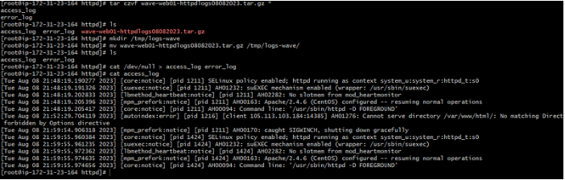

# Project-10: EC2 Log Management

[*Project Source*](https://www.udemy.com/course/decodingdevops/learn/lecture/26466336#overview)


## Step-1 : Create an EC2 instance

- Create an EC2 instance with the properties below:
```sh
Name tag: wave-web01
AMI: Amazon linux 2
Instance Type: t2.micro
SecGrp: wave-sg
keypair: wave-key
```


- userdata
```sh
#!/bin/bash
sudo yum install wget unzip httpd -y > /dev/null
sudo systemctl start httpd
sudo systemctl enable httpd
mkdir -p /tmp/webfiles
cd /tmp/webfiles
echo
 
wget https://www.tooplate.com/zip-templates/2098_health.zip > /dev/null
unzip 2098_health.zip > /dev/null
sudo cp -r 2098_health/* /var/www/html/
sudo systemctl restart httpd
```

- Install Httpd, start and enable service then deploy website from tooplate.com
```sh
sudo install httpd -y
sudo systemctl start httpd
sudo systemctl enable httpd
```


## Step-2: Create an s3 Bucket

- Create an s3 bucket to archive the EC2logs
```sh
Bucket name: wave-web-logs-322
Region: US East(Ohio) us-east-2
```

- Archive the EC2logs using the below commands
```sh
tar czvf wave-web01-httpdlogs08082023.tar.gz *
ls
mkdir /tmp/logs-wave
mv wave-web01-httpdlogs08082023.tar.gz /tmp/logs-wave/
ls
```



- clear the files using the below commands
```sh
cat /dev/null > access_log error_log
cat /dev/null > access_log
cat /dev/null > error_log
cat access_log
cat error_log
```

## Step-3: AWS CLI

- Use AWS cli to move the archived logs to an s3 bucket.
```sh
ls -ltr /tmp/logs-wave/
yum install awscli -y 
ls
aws s3 help
aws s3 ls
aws configure
```

## Step-4: Create User 

- Create an s3 user and configure aws using below properties
```sh
username: s3-log-admin
Managed policy: Amazons3FullAccess
AWS ACCESS Key ID:
AWS secret Access Key:
Default region name:us-east-2
Default output format: json
```

## Step-5: Synchronize the log file

- synchronize the log file using the below command and remove log file once done.
```sh
aws s3 cp /tmp/logs-wave/wave-web01-httpdlogs08082023.tar.gz s3://wave-web-logs-322/
rm -rf /tmp/logs-wave/*
```


## Step-6: Create a Cloudwatch log

- Install a cloudwatch agent and specify to stream access_log
- The access_log file streams everything to the cloud watch logs dashboard
- But first, create a IAM role to use EC2 instance with privilege of s3 access
```sh
Trusted entity: AWS service
Common use cases: EC2
Permission policies: s3 FullAccess
                     CloudWatchLogsFullAccess
Role name: log-admin-role
```

- Attach the created `IAM role` to EC2 instance `Actions` --> `Security` --> `Modify IAM Role` , select the role you created.


- Remove the aws credential with the below command
```sh
rm -rf .aws/credentials
aws s3 ls
```


- Install a cloudwatch agent and specify to stream access_log
```sh
yum install awslogs -y
```

- To specifically send logs of `/var/log/httpd/access-log` to cloud watch
- We have to update `vim /etc/awslogs/awslogs.conf` file for this:
```sh
[/var/log/messages]
datetime_format = %b %d %H:%M:%S
file = /var/log/messages
buffer_duration = 5000
log_stream_name = web01-sys-logs
initial_position = start_of_file
log_group_name = wave-web

[/var/log/access_log]
datetime_format = %b %d %H:%M:%S
file = /var/log/access_log
buffer_duration = 5000
log_stream_name = web01-httpd-access
initial_position = start_of_file
log_group_name = wave-web
```

- Confirm the path is active `cat /var/log/httpd/access_log` and restart the awslog afterwards.
```sh
cat /var/log/httpd/access_log
systemctl restart awslogd
systemctl enable awslogsd
```


P:S You can create metric filter on basis on real time logs and can also generate alarm basis on those metrics filter.

## Step-7: Generate logs from load balancer 
- Generate logs from load balancer and save it somewhere as ALB logs do not stream on cloud watch.
- Create load balancer
```sh
Name: wave-elb
Sec Grp: wave-elb-sg
Healthy threshold: 2
Instance: wave-web01
```


- In s3 bucket at permission section you have option bucket policies here we will define policy that allow the access from load balancer:
https://docs.aws.amazon.com/elasticloadbalancing/latest/classic/enable-access-logs.html


- s3 Bucket.json
```sh
{
  "Version": "2012-10-17",
  "Statement": [
    {
      "Effect": "Allow",
      "Principal": {
        "AWS": "arn:aws:iam::elb-account-id:root"
      },
      "Action": "s3:PutObject",
      "Resource": "arn:aws:s3:::bucket-name/prefix/AWSLogs/your-aws-account-id/*"
    },
    {
      "Effect": "Allow",
      "Principal": {
        "Service": "delivery.logs.amazonaws.com"
      },
      "Action": "s3:PutObject",
      "Resource": "arn:aws:s3:::bucket-name/prefix/AWSLogs/your-aws-account-id/*",
      "Condition": {
        "StringEquals": {
          "s3:x-amz-acl": "bucket-owner-full-control"
        }
      }
    },
    {
      "Effect": "Allow",
      "Principal": {
        "Service": "delivery.logs.amazonaws.com"
      },
      "Action": "s3:GetBucketAcl",
      "Resource": "arn:aws:s3:::bucket-name"
    }
  ]
}
```

- Now you will also see some text files at s3 bucket of load balancer


## Step-8: Clean up